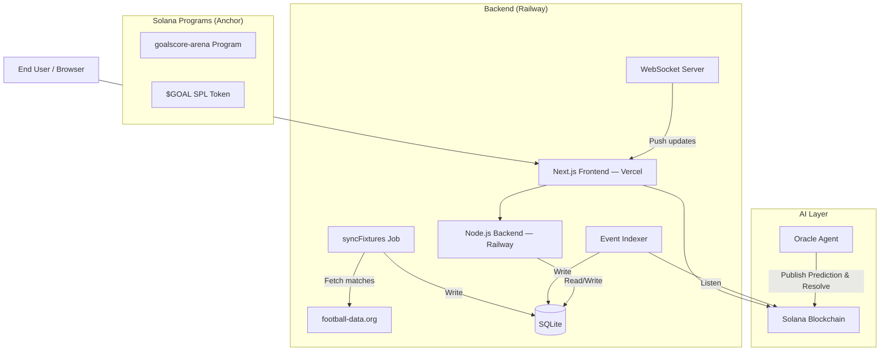

# GoalScore Architecture

GoalScore.fun is a football prediction arena on **Solana** where users bet SOL against other human players. The platform features an AI Oracle that provides match analysis and predictions, which users can unlock by holding $GOAL tokens to make more informed betting decisions. 1% fee, no house edge, pure on-chain.

## System Overview



## Stack

| Layer | Technology |
|-------|-----------|
| **Frontend** | Next.js 16, React 19, shadcn/ui, Privy auth |
| **Backend** | Node.js, Express, better-sqlite3, WebSocket |
| **Blockchain** | Solana (devnet → mainnet), Anchor framework |
| **Smart Contract** | `goalscore-arena` (Rust/Anchor) |
| **Token** | $GOAL SPL token (pump.fun deployment) |
| **Oracle** | Custom AI agent using football-data.org |
| **Hosting** | Vercel (frontend), Railway (backend) |
| **Auth** | Privy (wallet connect, social login) |

## Directory Structure

```
solana-goal/
├── frontend/              # Next.js app
│   ├── src/app/           # Pages: home, match, settings, leaderboard, goal, profile
│   ├── src/components/    # Navbar, Footer, UI components (shadcn)
│   ├── src/hooks/         # useBetting, useGoalBalance, useWebSocket
│   └── src/lib/           # api.ts (all API functions & types)
├── backend/               # Express API server
│   ├── src/routes/        # matches, users, leaderboard, agent, chain, oracle, admin
│   ├── src/services/      # footballData, chain, indexer, websocket
│   ├── src/jobs/          # syncFixtures, cleanupAccounts
│   └── src/db/            # schema, connection (SQLite)
├── goalscore-arena/       # Anchor program (Rust)
│   └── programs/goalscore-arena/src/lib.rs
├── agents/
│   └── oracle-agent/      # Oracle prediction & resolution agent
└── docs-web/              # Documentation site
```

## Smart Contract: goalscore-arena

Anchor program handling the match lifecycle on Solana:

- **`publish_prediction`** — Oracle sets Home/Draw/Away prediction for a match
- **`place_bet`** — Users bet SOL on Home (0), Draw (1), or Away (2) against other users.
- **`resolve_match`** — Oracle resolves with final result; winning players split the pot proportionally
- **`claim_winnings`** — Winners claim their share of the pot
- **Fee**: 1% to treasury on resolution
- **Draw handling**: Full refund to all bettors

## Backend API

| Endpoint | Method | Description |
|----------|--------|-------------|
| `/api/matches` | GET | List matches with filters (league, status, etc.) |
| `/api/matches/:id` | GET | Single match with arena data |
| `/api/matches/:id/bids` | GET | Bet activity for a match |
| `/api/users/:walletOrUsername` | GET | User profile with stats |
| `/api/users/claim-username` | POST | One-time username claim |
| `/api/users/upload-avatar` | POST | Upload avatar (base64, max 500KB) |
| `/api/users/update-email` | POST | Set/clear custom email |
| `/api/users/:wallet/pnl` | GET | P&L history |
| `/api/users/:wallet/referral` | GET | Referral code & count |
| `/api/leaderboard` | GET | Top players by stats |
| `/api/chain/*` | Various | On-chain data proxies |
| `/api/oracle/*` | POST | Oracle prediction submission |
| `/api/agent/*` | Various | Agent registration & metadata |

## Data Flow

1. **Match sync**: `syncFixtures` job fetches matches from football-data.org every 5 min → stores in SQLite with team names, logos (crests), kickoff times
2. **Oracle prediction**: Oracle agent analyzes match data → calls `publish_prediction` on-chain → backend indexes the event (unlockable by $GOAL holders)
3. **User bets**: Frontend builds Solana transaction → user signs with wallet → `place_bet` instruction against other human players → backend indexes bet event
4. **Match resolution**: Oracle agent detects final score → calls `resolve_match` → pot distributed on-chain to the winning side
5. **Claim**: User clicks "Claim" → `claim_winnings` instruction → SOL transferred

## Auth & Access Control

- **Privy**: Handles wallet connection, social login (Twitter/Google), email linking
- **$GOAL gating**: Oracle analysis/predictions require holding ≥1,000,000 $GOAL tokens
- **API docs**: Gated to ≥2,000,000 $GOAL holders (planned)

## Recent Changes (Feb/March 2026)

- Migrated from Monad (EVM) to **Solana** with Anchor programs
- Rebranded from GoalNad to **GoalScore**
- Pivoted architecture from AI vs AI / Human vs Oracle to **Human vs Human** (with Oracle providing locked predictive analysis to token holders)
- Added **settings page** with avatar upload, username, email, social connections, referral
- Added **leaderboard page** with player rankings dynamically calculated from direct match/bid history
- Fixed leaderboard API data mismatch and completely removed legacy internal AI agent tables 
- Added protocol auto-detection for API URL configuration
- Profile page with P&L chart, share cards, referral links
- Added global **Live Feed** ticker tracking open platform wagers
- Added **Sentry** (error monitoring), **PostHog** (analytics), and **Resend** (email notifications) integrations

## Environment Variables & External Services

To run the complete platform, the following external accounts and environment variables are required:

### Frontend (`frontend/.env.local` / Vercel)
- `NEXT_PUBLIC_SOLANA_RPC_URL` — Solana RPC endpoint (e.g. Helius, devnet/mainnet)
- `NEXT_PUBLIC_GOAL_TOKEN_MINT` — $GOAL SPL Token address for gating features
- `NEXT_PUBLIC_TREASURY_ADDRESS` — Treasury wallet address to collect 1% fee
- `NEXT_PUBLIC_API_URL` — Node.js backend URL
- `NEXT_PUBLIC_SENTRY_DSN` — **Sentry.io** DSN for Next.js error tracking (Required for monitoring)
- `NEXT_PUBLIC_POSTHOG_API_KEY` — **PostHog.com** project API key for product analytics (Required for analytics)
- `NEXT_PUBLIC_POSTHOG_HOST` — **PostHog.com** instance host (e.g. `https://us.i.posthog.com`)

### Backend (`backend/.env` / Railway)
- `DATABASE_URL` — SQLite / PostgreSQL connection string
- `SOLANA_RPC_URL` — Solana RPC endpoint for event indexer
- `FOOTBALL_DATA_TOKEN` — **football-data.org** API token for syncing match fixtures
- `SENTRY_DSN` — **Sentry.io** DSN for Node.js backend error tracking (Required for monitoring)
- `RESEND_API_KEY` — **Resend.com** API key for sending transactional emails (Required for email alerts)
