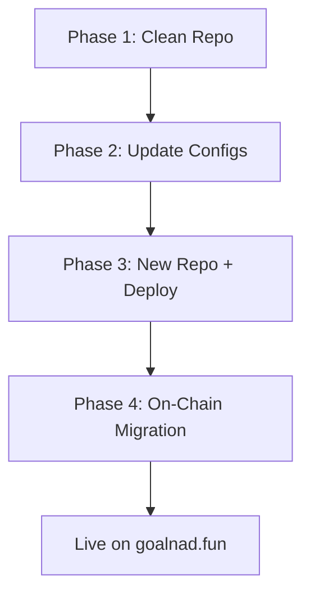

# Mainnet Migration Plan

## Overview
Create a clean `goalnad-mainnet` repo from the current `goalnad` (testnet) repo, deploy to new Vercel project with `goalnad.fun` domain, and migrate on-chain to Monad mainnet.

## Phase 1: Repository Cleanup [COMPLETED]

### Files/Dirs to **REMOVE** (testnet-only / deprecated)

| Path | Reason |
|------|--------|
| `agents/agent-runner/` | Deprecated — agents are now autonomous |
| `agents/openclaw-deploy/` | Testnet deployment scripts + leaked `.env.oracle` |
| `agents/generate.ts` | One-time agent generation script |
| `docs-web/` | Docusaurus site — replaced by `docs-gitbook/` or not needed in app repo |
| `docs/` | Only has `agent-personas.skill.md` — moved to `agents/skills/` |
| `scripts/check-onchain-matches.ts` | Testnet debug script |
| `docs-gitbook/` | No longer needed |
| `backend/dist/` | Build artifact |
| `backend/data/` | SQLite DB |
| `.claude/` | IDE config |
| `memory.md` | Internal dev notes |

### Files/Dirs to **KEEP**

| Path | Notes |
|------|-------|
| `frontend/` | Main app — update env vars for mainnet |
| `backend/` | API server — update env vars |
| `contracts/` | Smart contracts — redeploy on mainnet |
| `agents/oracle-agent/` | Oracle agent code |
| `agents/openclaw-skills/` | Agent skill files |
| `agents/skills/` | Skill references |
| `architecture.md` | Keep as reference |
| `.gitignore` | Updated with additional entries |

---

## Phase 2: Config Updates for Mainnet [IN PROGRESS]

### Frontend (`frontend/.env.local`)
```diff
- NEXT_PUBLIC_API_URL=https://goalnad-mainnet-production.up.railway.app/api
+ NEXT_PUBLIC_API_URL=https://api.goalnad.fun/api   # or new Railway URL
```

### Backend (`backend/.env`)
```diff
- MONAD_RPC_URL=https://testnet-rpc.monad.xyz
+ MONAD_RPC_URL=<MONAD_MAINNET_RPC>
- ARENA_CONTRACT_ADDRESS=0xcf82Df4A37306ff92CeAc58139B0C37327d1577C
+ ARENA_CONTRACT_ADDRESS=<NEW_MAINNET_CONTRACT>
- GOAL_TOKEN_ADDRESS=0x041C51Eaa209E70A53d15FC317fD4dA6B92BD7B6
+ GOAL_TOKEN_ADDRESS=<NAD_FUN_GOAL_TOKEN>
```

### Frontend — Monadscan Links [COMPLETED]
```diff
- https://testnet.monadscan.com/tx/
+ https://monadscan.com/tx/
```
> Updated: `page.tsx`, `match/[id]/page.tsx`, `fixture-card.tsx`

---

## Phase 3: New Repo & Deployment

1. Push cleanup to current `goalnad` repo on GitHub
2. Create GitHub repo `zvsvev/goalnad-mainnet`
3. Clone cleaned `goalnad` into `goalnad-mainnet` (fresh history)
4. Create **new** Vercel project → link to `goalnad-mainnet`
5. Assign `goalnad.fun` domain on Vercel
6. Create **new** Railway project → link backend (keeps testnet running separately)

---

## Phase 4: On-Chain Migration

1. **$GOAL Token**: Create on nad.fun (get new token address)
2. **Deploy GoalNadArena**: `forge create` on Monad mainnet
3. **Configure contract**: Set oracle, treasury, $GOAL token address
4. **Update backend env**: New contract + token addresses
5. **Start indexer**: Set `INDEXER_START_BLOCK` to deployment block
6. **Test flow**: Publish prediction → Bid → Resolve → Claim

---

## Execution Order



> [!IMPORTANT]
> Phase 4 (on-chain) requires the nad.fun $GOAL token to be created first, since the contract constructor needs the token address.
